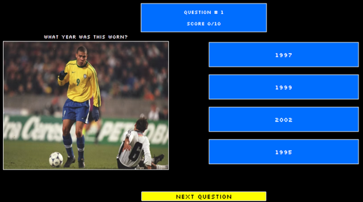
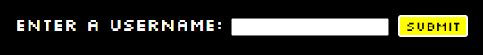

# Retro Football Quiz

## Table of Contents

- [Introduction](#introduction)
- [User-Stories](#user-stories)
- [Design](#design)
- [Features](#features)
- [Languages](#languages)
- [Testing](#testing)
- [Deployment](#deployment)
- [Bugs](#bugs)
- [Credits](#credits)

## Introduction

This website is designed for entertainment purposes. It consists of two different quizzes, which follow similar themes - old football shirts. The quiz has been created on one HTML page, with new features appearing as the user navigates through the site.

## User-Stories

### First-time users

- As a first-time user, I want to easily understand what the site is and offers, so I can decide if I will use it.
- As a first-time user, I want to navigate the website intuitively, so I can find what they are looking for.
- As a first-time user, I want to view the instructions, so I am aware of how to play.
- As a first-time user, I want to see what question I am on and what score I currently have, so I understand my progress.
- As a first-time user, I want to view my results, so I know my final score.
- As a first-time user, I want to be able to retake the quiz easily, so I can beat my score.
- As a first-time user, I want the site to be responsive on a variety of screen sizes so I can play anywhere.

### Returning users

- As a returning user, I want different game modes, so I can have a different experience.

### Website owner 

- As the owner, I want the website to be responsive so that users can use it on any device.
- As the owner, I want the website to be fun and interesting, so the user returns.

## Design

### Theme

The theme of the site is a homage to 1990's/2000's information services such as Ceefax and Teletext. As the content of the site refers to old football shirts, I wanted the design of the site to feel nostalgic and 'retro' for the user.  

### Font and Colours

The font chosen is SilkScreen with a back-up font of Sans-Serif in case of a loading error. I wanted to font to simulate early computer system fonts, as this era links with the theme of the site. As mentioned above, the inspiration for the colour scheme was taken from services such as Ceefax and Teletext, therefore a black background was chosen with bright colours used for buttons, borders and titles.

### Images

The images for the quiz were taken from a variety of sporting websites - see credits for more details. All images have been resized before adding to the site to ensure efficient formatting.

### Miro

This website was used in the planning process. It was a tool to create a flow for my site to follow. Using this board allow me to plan step-by-step, the quiz and the functionality my site needed. Here is a partial screenshot of my board.

### Wireframes

The following wireframes were produced at the start of the design process and have not been altered. These designs show the various screens I wanted to include.

#### Landing page

#### Game choice screen

#### Quiz 1

#### Quiz 2

#### Results screen 

## Features 

### Landing page title

- The title at the top of the landing page will take the user back to the begininning if they wish to restart the quiz.
- It is on display at every stage and step of the quiz for easy accessability for the user.
- Icons are used from Font Awesome to make it more appealing.

### Rules section

- On the landing page, the rules are displayed to the user, so they can make a quick decision if the site is of interest to them.
- These rules contain information on what to expect and how to proceed.
- The user must enter a username into the input field in order to continue.
- If the user tries to proceed without a username, then an alert will pop up.
- To protect against any potential username crashes, usernames are limited to 20 characters.
- Once the username has passed the validation a button appears, prompting the user to the next screen.

### Game choice selection 

- In this section the user has the option to select a game type.
- One game type is considered the 'easy' mode, where they have to guess the team the shirt belongs to.
- In this section the rules of both modes are explained.
- The other game mode is considered a harder mode, where the user needs to guess the year the photo was taken.
- Once the rules have been read the user may select an option.

### Quiz screen

- This is the main part of the quiz, where the question number, user score, out of how many questions, the question and image, four answer buttons and the next question button appear.
- As the user progress through the question, navigating using the 'next question' button, the question number will increment.
- If a user is successful in their answer the users score is incremented too.
- If a user is unsuccessful, a sentence appears, informing the user of the correct answer.

### Results screen

- In this section a container displays the users final score out of however many questions in the dataset.
- A unique written message containing their username appears, thanking the user for playing.
- An if statement was written to show different messages depending on the score the user had.
- Once a user has completed the quiz, a button is there to take the user back to the landing page.

### Future features

If this site was to be expanded, I would implement the following:
- Two new game modes - a harder guess the team mode and a guess the team badge mode.
- A message that warns the user they are leaving the page if they click the title button.
- More questions in each game mode.
- An option to choose a favourite team at the start and a colour scheme would apply to the site.
- A function could be used to shuffle the order of questions.

### Languages

- [HTML](https://en.wikipedia.org/wiki/HTML) was used to create the layout of the site.
- [CSS](https://en.wikipedia.org/wiki/CSS) was used to style the site.
- [JS](https://en.wikipedia.org/wiki/JavaScript) was used to create the functionality of the site.
- [Markdown](https://en.wikipedia.org/wiki/Markdown) was used to create this README file.

#### Technologies used 

- [Google Fonts](https://fonts.google.com/) - this was used to import the fonts Silkscreen.
- [Font Awesome](https://fontawesome.com/) - this was used in order to have icons load onto certain pages.
- [Simple Image Sizer](https://www.simpleimageresizer.com/) - this was used to convert images from JPEG to WEBP.
- [Image Resizer](https://imageresizer.com/) - this site was used to resize some of the images.
- [Balsamiq](https://balsamiq.com/) - this was utilised to create my wireframes.
- [Git](https://git-scm.com/) - this was used for version control, using the terminal to add, commit and push to GitHub.
- [Gitpod](https://www.gitpod.io/) - this was the IDE used to code.
- [GitHub](https://github.com/) - this is used to store, track and share my project.
- [GitHub pages](https://pages.github.com/) - this has been used to deploy my site.
- [Go Full Page](https://chromewebstore.google.com/detail/gofullpage-full-page-scre/fdpohaocaechififmbbbbbknoalclacl?hl=en) - to take full screen captures.
- [Responsive viewer](https://responsiveviewer.org/) - this was used to check responsiveness on a variety of devices.
- [JShint](https://jshint.com/) - this was utilised to check my JS file for errors.
- [Miro](https://www.miro.com) - this was used to create a workflow of the functions needed.

## Testing

Please see the [TESTING.md](TESTING.md) file for all testing conducted.

## Deployment

#### How to deploy the site

In order to deploy the site, follow these steps:

- Navigate to the correct repository [smithphil88/football-shirt-quiz](https://github.com/smithphil88/football-shirt-quiz) and click on the 'Settings' tab.
- On the left side under the menu 'Code and automation', click on the 'Pages' link.
- From the source section drop-down menu, select the 'Master Branch'.
- Once selected, the page will automatically refresh with a detailed ribbon, indicating a successful deployment.

- The link to the live address is here - [Football Quiz](https://smithphil88.github.io/football-shirt-quiz/)

#### How to clone the site

In order to clone the site and make a local copy, follow these steps:

- Go to the repository [smithphil88/football-shirt-quiz](https://github.com/smithphil88/football-shirt-quiz)
- Click on the 'Code' button, click on 'HTTPS' and copy the link.
- Open a terminal or GitBash and select where to store the cloned copy.
- When asked, type in **git clone** into the terminal.
- Then paste in the previous copied link to begin the cloning process.

## Bugs

A variety of bugs occured during the development process. With a combination of using my course facilitator, my mentor and Code Institute tutoring services, I was able to work through these issues.

This occured at the very end of the project when manually testing. All code and functionality worked as expected, however when changing username this error appeared. *Fixed by hiding the label, input field and button when the submit button was clicked.*

A bug appeared throughout the latter stages of the development process. This only appeared in the console and did not affect anything on the site - *fixed by removing an unnecessary script line of code.*

The biggest issue I faced in this project was passing my array for the second game mode - *fixed by creating a variable that allowed the game mode change, which held the specific set of data.*

## Credits

### Images

All images for the Guess the Shirt game were found on this website - [oldfoootballshirts](https://www.oldfootballshirts.com/en/index.php)

The images for the Guess the Year game were found from the following:

•	[Scotland](https://x.com/74frankfurt/status/1179651663948374018)

•	[Denmark](https://www.uefa.com/uefaeuro/history/news/025a-0eb91faf9bf0-942d69c5a0a8-1000--euro-1992-all-you-need-to-know/)

•	[Utd](https://elclasicofootball.com/products/manchester-united-1997-99-away-shirt-long-sleeve-size-l)

•	[Sampdoria](https://x.com/Betfred/status/1087795574789812224)

•	[England](https://thefootballheritage.com/product/england-1990-away-kit/)

•	[France](https://www.cultkits.com/blogs/news/top-10-kits-from-france-world-cup-1998)

•	[Nigeria](https://thelegendsrange.com/products/nigeria-world-cup-1996-home-shirt-okocha-10)

•	[Fiorentina](https://rarefootballshirts.com/product/acf-fiorentina-1999-2000-home-shirt/)

•	[Brazil](https://thefootballfaithful.com/nike-re-release-classic-brazil-1998-shirt-for-copa-america/)

•	[AC-Milan](https://x.com/ProD_Soccer/status/1182657672329478145)

