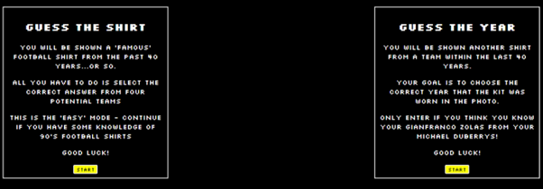
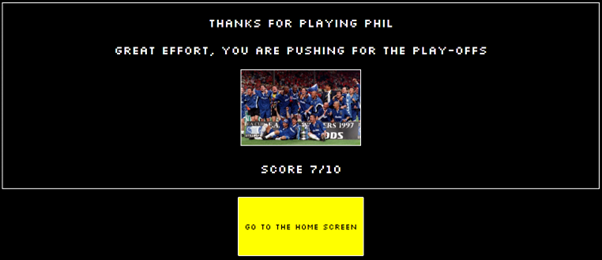

# Retro Football Shirt Quiz

## Testing

In this file, I will demonstrate the tests taken to ensure that the site functions as it should. In the criteria of the assessment, testing is a crucial part of the process of development and here I will aim to prove that I have taken the principles of testing into consideration.

### User Stories

#### First-time users

In this section, I will evidence the user-stories.

- As a first-time user, I want to easily understand what the site is and offers, so I can decide if I will use it. ***Pass***

- As a first-time user, I want to navigate the website intuitively, so I can find what they are looking for. ***Pass***

- As a first-time user, I want to view the instructions, so I am aware of how to play. ***Pass***

- As a first-time user, I want to see what question I am on and what score I currently have, so I understand my progress. ***Pass***

- As a first-time user, I want to view my results, so I know my final score. ***Pass***

- As a first-time user, I want to be able to retake the quiz easily, so I can beat my score. ***Pass***

- As a first-time user, I want the site to be responsive on a variety of screen sizes so I can play anywhere. ***Pass***

#### Returning users

- As a returning user, I want different game modes, so I can have a different experience. ***Pass***

#### Website owner

- As the owner, I want the website to be responsive so that users can use it on any device. ***Pass***

- As the owner, I want the website to be fun and interesting, so the user returns.***Pass***

[Returns](documentation/results-4.png)

[Returns](documentation/results-1.png)

[Returns](documentation/game-selection.png)

### Validation

HTML validation - ***passed***

The HTML validator warnings regarded the lack of content within my headings but as the JS script provided these headings - the warning can be safely ignored.

CSS validation - ***passed***

JShint - ***passed***

### Lighthouse

I ran the site through the lighthouse testing suite in devtools and all passed.

### Responsiveness

| Device and size | Screenshot | Comments |
| --- | --- | --- |
| Mobile (Chrome DevTools) |  | Pass |
| Mobile (Pixel 7) |  | Pass |
| Mobile (Iphone-14) |  | Pass |
| Tablet (Chrome DevTools) |  | Pass |
| Tablet (ipad) |  | Pass |
| Tablet (Chrome DevTools) |  | Pass |
| Large laptop (1440px) |  | Pass |
| Desktop (iMac) |  | Pass |

### Browser Compatability

I have tested my site on a number of browsers to check for any issues.

| Browser | Screenshot | Comments |
| --- | --- | --- |
| Chrome |  | Works as expected |
| Edge |  | Works as expected |
| Firefox |  | Works as expected |
| Brave |  | Works as expected |

### Manual Testing

#### Rules and Selection screens

| Feature | Expected Outcome | Testing Performed | Result | Pass/Fail |
| --- | --- | --- | --- | --- |
| Title of site | Redirect to Landing Page | Click logo | Redirects to Home Page | Pass |
| User Submit | A welcome message appears with their username | Enter a username | Welcome message appears | Pass |
| User-Validation | A username cannot be more than 20 characters | Entered a username longer than 20 characters | An alert appears informing user to shorten their name | Pass |
| Game-choices | Direct user to the game choice selection screen | Click game-choice button | Redirects game choice selection screen | Pass |
| Title of site | Redirect to Landing Page | Click logo | Redirects to Home Page | Pass |

#### Quiz

| Feature | Expected Outcome | Testing Performed | Result | Pass/Fail |
| --- | --- | --- | --- | --- |
| Title of site | Redirect to Landing Page | Click logo | Redirects to Home Page | Pass |
| Answer button correct| If a user clicks a correct answer, the button turns green | Click answer button | Answer button turns green | Pass |
| Answer button incorrect| If a user clicks an incorrect answer, a sentence appears with the correct answer| Click answer button | A sentence appears with the correct answer | Pass |
| Answer button correct| If a user clicks a correct answer, the score increases by one | Click answer button | User score increases by one | Pass |
| Answer button incorrect| If a user clicks an incorrect answer, the score stays the same | Click answer button | User score stays the same | Pass |
| Next button | If a user clicks the next button, the next question appears | Click next question button | A new question appears | Pass |
| Question number | If a user clicks the next button, the current question number increases by one | Click next question button | The current question number increases by one | Pass |
| Hover over answer button | If a user hovers over an answer, the buttons turns dark blue, so they know where the cursor is | Hover over an answer button | The answer button becomes darker | Pass |
| Hover over next button | If a user hovers over the next question button, it inverts the colours, so they know where the cursor is | Hover over the next question button | The colour on the next question button inverts | Pass |

#### Results 

| Feature | Expected Outcome | Testing Performed | Result | Pass/Fail |
| --- | --- | --- | --- | --- |
| Final score | Score is retained throughout quiz and displayed at the end | Checked visually | Final score is avaliable to the user | Pass |
| Username result | The username entered is used in a thank you message | Checked visually | Username is on show | Pass |
| Result messages | The user recieves a differentiated message depending on what score they recieved | Checked visually | Different message appear on the results screen | Pass |
| Result images | The user recieves a differentiated image depending on what score they recieved | Checked visually | Different images appear on the results screen | Pass |
| Return to start | The user can return to the start of the quiz to restart | Button clicked | Redirected to landing page | Pass |

### Wave accessability

This site was used to check for any errors in my site - it provided one error, which has now been addressed. The error stated my username input did not have an associated label that matched.

### README

A link back to the [README](README.md) file.