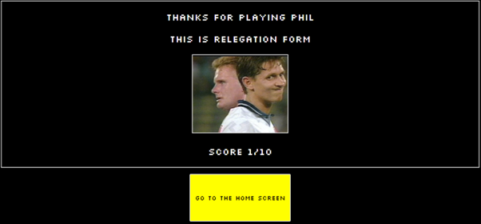

# Retro Football Shirt Quiz

## Testing

In this file, I will demonstrate the tests taken to ensure that the site functions as it should. In the criteria of the assessment, testing is a crucial part of the process of development and here I will aim to prove that I have taken the principles of testing into consideration.

### User Stories

#### First-time users

In this section, I will evidence the user-stories.

- As a first-time user, I want to easily understand what the site is and offers, so I can decide if I will use it. ***Pass***

- As a first-time user, I want to navigate the website intuitively, so I can find what they are looking for. ***Pass***

- As a first-time user, I want to view the instructions, so I am aware of how to play. ***Pass***

- As a first-time user, I want to see what question I am on and what score I currently have, so I understand my progress. ***Pass***

- As a first-time user, I want to view my results, so I know my final score. ***Pass***

- As a first-time user, I want to be able to retake the quiz easily, so I can beat my score. ***Pass***

- As a first-time user, I want the site to be responsive on a variety of screen sizes so I can play anywhere. ***Pass***

#### Returning users

- As a returning user, I want different game modes, so I can have a different experience. ***Pass***

#### Website owner

- As the owner, I want the website to be responsive so that users can use it on any device. ***Pass***

- As the owner, I want the website to be fun and interesting, so the user returns.***Pass***

[Returns](documentation/results-4.png)

[Returns](documentation/results-1.png)

[Returns](documentation/game-selection.png)

### Validation

HTML validation - ***passed***

The HTML validator warnings regarded the lack of content within my headings but as the JS script provided these headings - the warning can be safely ignored.

CSS validation - ***passed***

JShint - ***passed***

